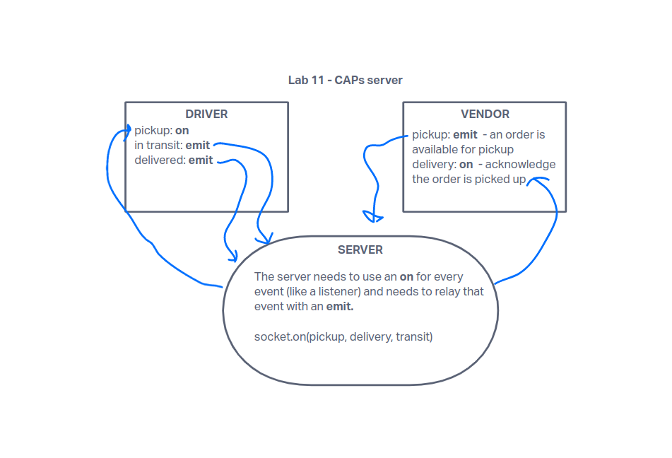

# CAPs - Code Academy Parcel Service

Starter lab for Code Fellows 401 Advanced JavaScript - Week 3

A simulated parcel delivery system using Node.js with an event-driven architecture.

## Author

**Kyle Freemantle**

## Version

1.0.0

## Overview

The CAPs system simulates a package delivery process, from vendor, through transit, to delivery to customer. It uses an event-driven architecture to manage package state and emit notifications throughout the delivery process.  The purpose of this code is to be instructional about *states*, *emit* and *on* methods.

## Getting Started

1. Clone the repository.
2. Run `npm install`.
3. Run `npm start`.

Optional - Run `npm test CAPs` to run the test file.

## Architecture

The CAPS system is built using Node.js and follows an event-driven architecture. It uses the EventEmitter class to manage events and event handlers. The project is structured with a modular approach, separating the logic for vendors, drivers, and the global event pool.

## Change Log

04-28-2023 - Refactored to use socket.io
04-17-2023 - Initial implementation

## Credits and Collaborations

- [Chance.js](https://chancejs.com/): A library for generating random data.
- ChatGPT v4 for assistance with verbose comments to help me understand the syntax and request flow.
- Steven Gantz, fellow Code Fellows student for reference https://github.com/stevengant

## UMLs

### Lab 11

### Lab 12

